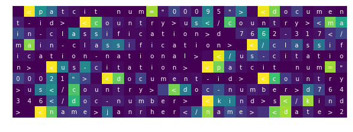

# How does LSTM's internal memory work? 

The Long-Short Term Memory (LSTM) is the most commonly used deep learning technique for sequential data. As its name indicates, LSTM can learn long term relationships by using _memory cells_ and a bunch of control gates. A lot of cool examples, such as article and code generation, demonstrate the power of this technique. But how does it manage to do these jobs? What exactly have the memory cells learned, and how that helps for text generation? In here, we'll break into the LSTM model and take a look at the memory cells' states and the control gates to find out their behavior during text generation. 

We'll build a character-level LSTM model to generate XML texts. The XML syntax clearly requires long term dependencies for closing the tags. Once our model learned this syntax, we look into it and try to find out how it manages to do this. All is demonstrated in `LSTM_memory_cells.ipynb` step by step. 

## Structure

* `LSTM_memory_cells.ipynb`: this notebook explores how LSTM's internal memory works and goes through it step by step. 

* `char_level_rnn.py`: a simple class that creates, trains a character-level LSTM model and generates texts. For more details about the model, see `LSTM_memory_cells.ipynb`. 

* `utils.py`: utility functions, for extracting LSTM internal states and plotting. 

* `data/`: the training data. It's a subset of the [patent grant](https://www.kaggle.com/uspto/patent-grant-full-text) dataset. Some tags with long contents are removed for simplicity. See `LSTM_memory_cells.ipynb` for more details. 

* `models/`: a trained model. See `LSTM_memory_cells.ipynb` for more details. 
