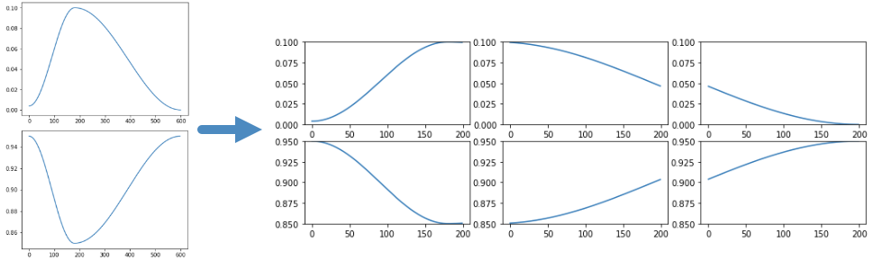

# Divide a long 1cycle policy into smaller ones





## Motivation

The [1cycle policy](https://arxiv.org/pdf/1803.09820.pdf) is adopted as the default training method by [fastai](https://docs.fast.ai/). From my limited experiences and not so rigorous performance tests with the fastai's implementation, it turns out for the following three training policies, (1) works the best: 

(1) run 1cycle policy for 40 epochs.

(2) run 1cycle policy for 20 epochs, then run another 1cycle policy with smaller max learning rate.

(3) run 1cycle policy for 10 epochs, run again for 10 epochs with same max learning rate, and run again for another two cycles. 

It kinds of makes sense, you'd rather just run 1cycle policy once, it's literally _one_ cycle. Of course there're other parameters, such as `div_factor` and `pct_start`, that also matter a lot, but I fixed those parameter in the comparison, for simplicity.

Now the problem comes. For some tasks, running a few epochs already costs considerable time, not to say 20 epochs. Chances are __we want to run 20 epochs but failed at epoch 9__. If you happened to have saved the model at epoch 8 (e.g., using `SaveModelCallback`), then the most efficient way will be to run starting from there. Although the fastai library doesn't support it directly, you can do it by slightly modifying the `OneCycleScheduler`. 


## How to run

The `PartialOneCycleScheduler` inherits `OneCycleScheduler` and made the changes we discussed above. To use it, for example, run a 20 epoch 1cycle policy starting from epoch 8:

```
from partial_one_cycle_scheduler import PartialOneCycleScheduler

learn.load('epoch_8')
ocs = PartialOneCycleScheduler(learn, lr_max, tot_epochs=20, start_epoch=8)
learn.fit(12, lr_max, wd=wd, callbacks=[ocs])
```

The `fit` actually runs 12 epochs. 

Another example, to run a 20 epoch 1cycle policy from epoch 8 to 15:
```
learn.load('epoch_8')
ocs = PartialOneCycleScheduler(learn, lr_max, tot_epochs=20, start_epoch=8)
learn.fit(7, lr_max, wd=wd, callbacks=[ocs])
```

The `fit` actually runs 7 epochs. 

If we omit the two additional arguments:
```
ocs = PartialOneCycleScheduler(learn, lr_max)
learn.fit(cyc_len, lr_max, wd=wd, callbacks=[ocs])
```

Then it will be the same as the `OneCycleScheduler`, i.e., it'll start from epoch 0 and run `cyc_len` epochs. 

Check this [notebook](divide_1cycle.ipynb) for more explanation and comparison. 
